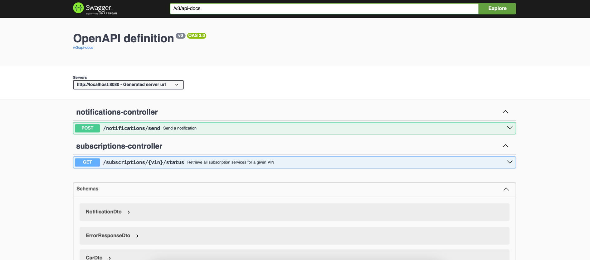
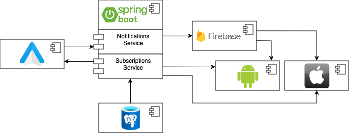

# Škoda Connect Services Tender Backend



## Overview
This project is a Spring Boot application that provides various services related to car connectivity. It includes functionalities such as:  

* Fetching all subscription services associated with a specific Vehicle Identification Number (VIN). This includes detailed information about the user, car, and the list of subscription services.
* Sending notifications with details such as VIN, title, and message.

The application is designed to handle various backend operations for Škoda Connect Services, ensuring seamless car connectivity and user management.

## Architecture
This project serves as the central backend for the Android Auto, Android mobile app, and iOS app to communicate with. The project follows a layered architecture, with the following components:



## CI/CD Strategy
Our CI/CD pipeline ensures code quality and smooth deployments through the following stages:  

### Pull Request Checks
Every pull request triggers the following checks:

* SonarQube Analysis: Code is analyzed against SonarQube rules to ensure code quality and security.
* Spotless Linter: Code formatting is checked using the Spotless plugin.
* JUnit Tests: Unit tests are executed to verify the functionality of the code.

### Development Branch
When code is committed to the dev branch, the following additional checks and deployments occur:  

* Black Duck Scan: The code is scanned for open-source vulnerabilities using Black Duck.
* Automatic Deployment to Development Environment: If all checks pass, the code is automatically deployed to the development environment.

### Main Branch
Releases to the main branch follow this process:

* Automatic Deployment to Staging Environment: Code is automatically deployed to the staging environment.
* Manual Deployment to Production: After all tests pass and QA approves, a manual deployment to the production environment can be performed.

## Prerequisites
To set up and run this project locally, you need the following:

- Java 17
- Docker
- Maven
- An IDE (e.g., IntelliJ IDEA)

## Setup Instructions

### Build the Project
Ensure you have Java 21 installed and set up. Then, build the project using Maven:
```sh
mvn clean install
```

### Configure Environment Variables
Copy the `.env.sample` file to `.env` and fill in the appropriate settings for the database:
```sh
cp .env.sample .env
```
Edit the `.env` file to include your database settings:
```dotenv
POSTGRES_HOST=localhost
POSTGRES_PORT=5432
POSTGRES_DB=your_database
POSTGRES_USER=your_user
POSTGRES_PASSWORD=your_password
FIREBASE_CREDENTIALS=firebase_credentials_string_of_json
```

### Start Docker Compose
Start the required services using Docker Compose:
```sh
docker-compose up
```

Run the Application
You can run the application with the local profile using Maven:
```
mvn spring-boot:run -Dspring-boot.run.profiles=local
```

### Access the Application
Once the application is running, you can access it at:
```
http://localhost:8080
```

## API Documentation
The project uses `springdoc-openapi-starter-webmvc-ui` for API documentation. You can access the OpenAPI UI at:
```
http://localhost:8080/swagger-ui.html
```

## Code Formatting with Spotless
This project uses the Spotless plugin for code formatting. To check and apply formatting, use the following Maven commands:

- To check the formatting:
  ```sh
  mvn spotless:check
  ```

- To apply the formatting:
  ```sh
  mvn spotless:apply
  ```

## Configuration
You can customize the application settings in the `application.yml` file located in the `src/main/resources` directory.

## Contributing
Please follow the code formatting guidelines enforced by the Spotless plugin. Ensure all tests pass before submitting a pull request.
